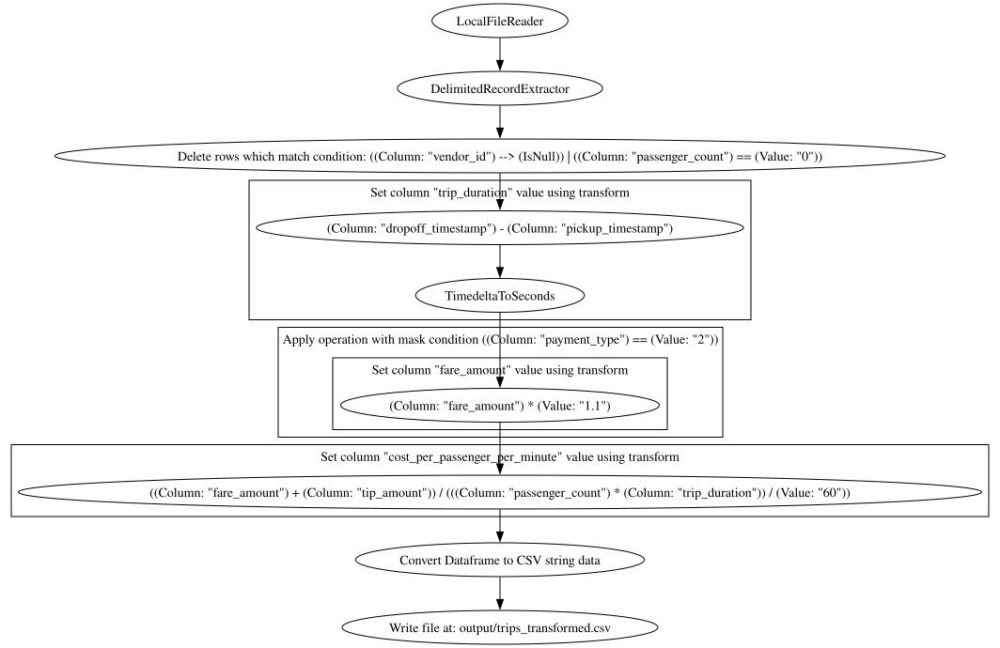

# framechain

A library for declaratively building data-transformation pipelines on top of pandas. Pipelines are assembled from small, configurable `Operation` classes with simple interfaces — the library handles the fiddly pandas mechanics underneath (dtype coercion, copy semantics, conditional/column-scoped application), so pipeline code stays about *what* happens, not how to do it safely and efficiently in pandas.

> [!NOTE]
> Personal project, built while working at a telco data platform (~2021–2022). Not published to PyPI, not actively maintained — published here as a portfolio piece, not a supported package.

A pipeline is built from three kinds of component, each just an `Operation`:

- **Extractors** parse raw input (CSV, fixed-width binary records, ASN.1-encoded records, …) into a pandas DataFrame
- **Operations** filter, join, and transform the data — including scoping a transform to specific columns or to rows matching a condition, without copying the whole DataFrame
- **Writers** send the result somewhere

Chaining these together with `>>` produces one runnable pipeline object, with execution profiling and Graphviz visualization built in.

## How it works

A pipeline is a single composed `Operation` object, built entirely from Python's operator overloading — no separate execution engine. The base class, `Operation` (`framechain/operations/base.py`), overloads:

- `>>` — chain operations sequentially (output of the left becomes input of the right), auto-flattening nested chains into one `ChainedOperations`
- `&`, `|`, `~` — boolean-style combination and inversion
- `+ - * / // % **` — arithmetic, elementwise on vectors or scalar
- `> < == != >= <=` — comparisons, producing boolean masks
- `[]` — slicing (including vectorised string slicing on a `pd.Series`)

So pipeline code reads like the pandas expression it represents, while staying **lazy, composable and introspectable** — nothing runs until the pipeline is called with an input. For example, an extractor parses a CSV into a DataFrame, a couple of operations clean it up and derive a new column, and a writer exports the result — all chained with `>>` into one callable:

```python
record_extractor = DelimitedRecordExtractor(fields=[
    IntegerField('vendor_id', column_id='VendorID', size=8),          # cast the VendorID column to a nullable int
    TimestampField('pickup_timestamp', column_id='tpep_pickup_datetime'),
    TimestampField('dropoff_timestamp', column_id='tpep_dropoff_datetime'),
])

pipeline = (
    LocalFileReader() >> record_extractor                              # read the file, parse into a typed DataFrame
    >> DropRows(Column('vendor_id') >> IsNull())                       # drop rows with a missing vendor_id
    >> SetColumn(                                                      # add a trip_duration column, computed as:
        'trip_duration',
        (Column('dropoff_timestamp') - Column('pickup_timestamp')) >> TimedeltaToSeconds(),  # dropoff - pickup, in seconds
    )
    >> DataFrameToCSVExporter() >> LocalFileWriter('output/trips.csv')  # export to CSV and write to disk
)

pipeline('data/yellow_tripdata_2021-01.csv')
```

*(imports omitted for brevity — [Quickstart](#quickstart) below builds this same pipeline up in full, one component at a time, with imports, profiling, and visualization)*

A raw Python value or plain function dropped into a pipeline is auto-wrapped as a `Value` or `Lambda` operation by `convert_to_operation()`, so scalars and callables compose transparently alongside `Operation` instances. And because every node is a plain, introspectable Python object, the library gets execution profiling and Graphviz visualization for free — see [Quickstart](#quickstart) and [Core concepts](#core-concepts) below.

## Installation

Not published to PyPI. Install from a clone in editable mode:

```bash
git clone <repo-url>
cd framechain
pip install -e ".[dev]"
```

Optional extras (from `pyproject.toml`), combine as needed, e.g. `pip install -e ".[dev,viz]"`:

| Extra | Adds | Unlocks |
|---|---|---|
| `dev` | `pytest` | Running the test suite |
| `viz` | `pydot`, `snakeviz` | `show_graph()` pipeline visualization and `profile_snakeviz()` profiling UI |
| `crypto` | `pycryptodome` | AES encrypt/decrypt operations (`framechain/operations/cryptography.py`) |
| `hdfs` | `hdfs` | `HDFSFileSystemWriter` |
| `cython-experiments` | `Cython` | The experimental Cython-accelerated ASN.1 BER decoder |
| `numba-experiments` | `numba` | The experimental Numba-accelerated ASN.1 BER decoder |

Core runtime dependencies are just `pandas`, `numpy`, `pytz`, and `python-dateutil`. Requires Python 3.8+.

## Quickstart

This builds a pipeline over the public [NYC TLC Yellow Taxi trip data](https://www1.nyc.gov/site/tlc/about/tlc-trip-record-data.page), one component at a time — an extractor, some operations, and a writer — then chains them together. See `Demo.ipynb` for the same pipeline as a runnable notebook.

### Extractors

An extractor parses raw input into a typed pandas DataFrame. Each field declares its own name, source column, and dtype, so there's no separate `read_csv()` + manual coercion step:

```python
from framechain.operations.io import LocalFileReader
from framechain.operations.pandas.record_extractors.delimited import (
    DelimitedRecordExtractor, NumberField, TimestampField, IntegerField, StringField,
)

record_extractor = DelimitedRecordExtractor(
    fields=[
        IntegerField('vendor_id', column_id='VendorID', size=8),
        TimestampField('pickup_timestamp', column_id='tpep_pickup_datetime'),
        TimestampField('dropoff_timestamp', column_id='tpep_dropoff_datetime'),
        IntegerField('passenger_count', size=8),
        NumberField('distance', column_id='trip_distance'),
        IntegerField('pickup_location_id', column_id='PULocationID'),
        IntegerField('dropoff_location_id', column_id='DOLocationID'),
        IntegerField('payment_type', size=8),
        NumberField('fare_amount'),
        NumberField('tip_amount'),
        NumberField('congestion_surcharge'),
    ],
)
read_extract_records = LocalFileReader() >> record_extractor

df = read_extract_records('data/yellow_tripdata_2021-01.csv')
```

### Operations

Operations filter, clean, and transform the DataFrame, composed with the overloaded operators from [How it works](#how-it-works) above. This drops invalid rows, derives a trip-duration column, applies a 10% surcharge only to card payments, and computes a derived rate:

```python
from framechain.operations.pandas import DropRows, Column, IsNull, TimedeltaToSeconds, SetColumn, DFWhere

remove_bad_data = DropRows((Column('vendor_id') >> IsNull()) | (Column('passenger_count') == 0))

calculate_duration = SetColumn(
    'trip_duration',
    (Column('dropoff_timestamp') - Column('pickup_timestamp')) >> TimedeltaToSeconds(),
)

add_card_surcharge = DFWhere(
    Column('payment_type') == 2,
    SetColumn('fare_amount', Column('fare_amount') * 1.1),
)

calculate_cost_per_passenger_per_minute = SetColumn(
    'cost_per_passenger_per_minute',
    (Column('fare_amount') + Column('tip_amount')) / (Column('passenger_count') * Column('trip_duration') / 60),
)

transforms = remove_bad_data >> calculate_duration >> add_card_surcharge >> calculate_cost_per_passenger_per_minute
```

`add_card_surcharge` deliberately uses `DFWhere` rather than a plain `df.loc[mask, 'fare_amount'] *= 1.1` — see [Core concepts](#core-concepts) for why that matters beyond style.

### Output generators

Output generators/writers send the result somewhere. Exporting a DataFrame to a format (CSV, here) and writing the result out are separate, composable steps:

```python
from framechain.operations.pandas import DataFrameToCSVExporter
from framechain.operations.io import LocalFileWriter

write_output = DataFrameToCSVExporter() >> LocalFileWriter('output/trips_transformed.csv')
```

### Putting it together

Each of the three components above is just an `Operation`, so they chain together the same way as anything else, into one pipeline running from a raw file path to a written output file:

```python
full_pipeline = read_extract_records >> transforms >> write_output
full_pipeline('data/yellow_tripdata_2021-01.csv')
```

The same pipeline object also gives you profiling and visualization for free, with no extra setup:

```python
full_pipeline.profile_snakeviz('data/yellow_tripdata_2021-01.csv')  # opens a SnakeViz flame graph in Jupyter
full_pipeline.show_graph()  # renders the pipeline structure as a Graphviz diagram
```



*The actual output of `show_graph()` for the pipeline built above.*

## Core concepts

**Operator-based chaining.** `>>` is the pipeline backbone: `a >> b >> c` builds a single `ChainedOperations` (flattening automatically, so chaining a chain doesn't nest), which calls each stage in order, passing output to input. Any pipeline is itself just an `Operation`, so it can be embedded inside a larger one.

**`Column` / `SetColumn`.** `Column('x')` extracts column `'x'` from whatever DataFrame or Series it's called with, and participates in arithmetic/comparisons like any other operation. `SetColumn('y', <transform>)` runs `<transform>` against the input and assigns the result onto column `'y'`, returning a new (shallow-copied) DataFrame.

**`DFWhere` / `SeriesWhere` and `get_required_columns()`.** These apply a wrapped operation only to rows matching a boolean mask, then merge the result back in. `DFWhere` (the DataFrame version) is genuinely optimized: `DataframeOperation` subclasses (`Column`, `SetColumn`, `DropColumns`, `Merge`, etc.) each implement `get_required_columns()`, and `DFWhere` walks the wrapped operation tree (`Operation.search()`) to infer exactly which columns it needs and changes — then slices the DataFrame down to just those columns before masking and copying, instead of copying the whole frame. It refuses to wrap `DropRows`, `DropColumns`, `RenameColumns`, or `Explode` (raising `InvalidOperationError`), since those would break the masking strategy.

**Extractor → transforms → writer.** The idiomatic shape of a full pipeline is `Extractor >> transform_operations >> Writer`, as built up in [Quickstart](#quickstart) above.

**Built-in observability.** Every `Operation` tracks its own execution profile — `enable_profiling()`/`disable_profiling()` toggle a custom recorder that attributes call counts and cumulative/self time *per operation instance*, correctly splitting time across multiple parents that share a child operation (something a flat profiler can't do). `profile_snakeviz(input)` runs the pipeline under this profiler and opens the result in [SnakeViz](https://jiffyclub.github.io/snakeviz/) inside Jupyter. `show_graph()` renders the pipeline as a Graphviz diagram. Both require the `viz` extra.

## Operation catalogue

Grouped by module, not exhaustive — see docstrings in source for full parameter details.

**Core / generic** (`framechain/operations/{general,control,logical,conditional,wrappers}.py`)

| Operation | Purpose |
|---|---|
| `Value`, `Lambda`, `Pass` | Wrap a constant, a plain callable, or a no-op into an `Operation` |
| `ChainedOperations` | The result of `>>` chaining; also constructible directly |
| `If`, `SwitchCase` | Branch on a condition or a mapped key |
| `Fork`, `CollectFrom`, `Map` | Run multiple chains on one input; collect/iterate a sequence |
| `MapValue`, `GetAttr`, `Filter`, `Length` | General value mapping/attribute access/filtering |
| `CallMethod` | Call an (optionally dotted) method on the input object |
| `ContextValue` | Pull a value from the ambient transform context dict |
| `Print`, `RaiseException` | Debugging / explicit failure |
| `In`, `Is`, `And`, `Or`, `Not` | Operations backing `in`/`is`/boolean logic (since those Python operators can't be overloaded to stay lazy) |
| `StringContains`, `StringIsNumeric`, `IsInstance` | Scalar string/type checks |
| `Cached`, `MapArguments` | Memoize a scalar transform; build multi-arg calls from one input |

**Pandas column/value operations** (`framechain/operations/pandas/{general,conditional}.py`)

| Operation | Purpose |
|---|---|
| `Column` | Select a column from a DataFrame or a field from a row Series |
| `MapColumnValues`, `ColumnOfValue`, `FillNA` | Value mapping, constant column, NA filling |
| `Min` / `Max` | Row-wise or column-wise min/max |
| `Copy`, `PrintDF` | Defensive copy; debug-print a DataFrame |
| `IsIn`, `IsNull`, `IsEmpty`, `StringContains`, `StartsWith`, `IsNumeric`, `FieldExists` | Boolean-mask-producing column conditions |
| `MergeRowValues` | Combine several row fields with a custom merge/filter function |

**DataFrame-level operations** (`framechain/operations/pandas/dataframe.py`)

| Operation | Purpose |
|---|---|
| `DropRows`, `DropColumns`, `RenameColumns`, `Sort` | Standard row/column manipulation |
| `MultipleFillNA`, `Explode` | Bulk NA fill; explode list-like column into rows |
| `Combine`, `CombineFirst` | Elementwise / first-non-null combination of two columns |
| `SelectColumns`, `AlignCategories` | Column projection/ordering; align categorical dtypes |
| `Merge` | Join two DataFrames — validates that join-column dtypes actually match before merging, raising a clear `TypeError` instead of a confusing downstream failure |
| `CreateDuplicateRows` | Duplicate rows matching a condition |

**Pipeline-construction operations** (`framechain/operations/pandas/constructors.py`)

| Operation | Purpose |
|---|---|
| `SetColumn`, `ConvertColumn` | Assign a column from a transform; convenience wrapper for in-place column conversion |
| `MapToColumns` | Apply a row-wise mapping function over several columns; auto-detects which columns to pass from the mapped function's own argument names |
| `UseColumns` | Restrict a sub-pipeline to a column subset for performance, re-integrating the result |
| `SetField`, `Apply` | Set a field on a row Series; vectorised `Series.apply` wrapper |
| `SeriesWhere`, `DFWhere` | Conditionally apply a sub-pipeline to masked rows (see Core concepts) |
| `ConstructDataFrame`, `ConstructSeries` | Build a DataFrame/Series from arbitrary input data |

**Dtype / datetime transforms** (`framechain/operations/pandas/transforms/{conversions,numeric,timestamps}.py`)

| Operation | Purpose |
|---|---|
| `AsType`, `StringToInteger`, `ToList`, `ToArray` | Type conversion — `AsType` refuses `.astype(str)` unless `allow_str=True` is explicitly passed, since it silently turns `NaN` into the string `"nan"` |
| `ToNumeric`, `ToNullableInteger`, `Floor` | Numeric coercion, including pandas nullable-integer dtype |
| `ColumnToDatetime`, `ToTimedelta`, `TimestampFromColumns` | Parse/construct datetime and timedelta columns |
| `SetColumnTimezone`, `ConvertTimezone` | Localize/convert timezone on a datetime column |
| `DateTimeProperty`, `DatetimeToString`, `TimedeltaToSeconds` | Extract a datetime attribute; format/convert timedelta |

**String transforms** (`framechain/operations/pandas/transforms/string.py`)

| Operation | Purpose |
|---|---|
| `StringColumnSplit`, `StringColumnJoin` | Split a column into parts / join columns into one |
| `Replace`, `Strip`, `StringLength` | String cleanup |
| `ColumnRegexExtract`, `ColumnRegexFindall` | Regex extraction against a column |
| `BytesColumnToString` | Decode a bytes column to string |

**Validation** (`framechain/operations/pandas/validation.py`)

| Operation | Purpose |
|---|---|
| `Validate` | Assert a condition holds over the input, raising on failure |

## Extractors & writers

Extractors (`framechain/operations/pandas/record_extractors/`) turn raw input into a typed pandas DataFrame, driven by a per-field schema (each field declares its own name, source position/key, and dtype/converter):

- **`DelimitedRecordExtractor`** — the most commonly used extractor; wraps `pandas.read_csv` with per-field dtype injection via typed `Field` classes (`IntegerField`, `NumberField`, `TimestampField`, `StringField`, ...), as used in the quickstart above.
- **`BinaryFixedWidthRecordExtractor`** ("BFW") — byte-offset/length field records, used originally for legacy telecom switch output formats.
- **`ASN1BERRecordExtractor`** — a hand-written ASN.1 BER decoder for telecom CDR/billing records, selecting fields by ASN.1 tag path. The most involved part of the codebase's telecom heritage — see `framechain/operations/pandas/record_extractors/asn1_ber/`. Also ships **experimental Cython- and Numba-accelerated decoder variants** (behind the `cython-experiments`/`numba-experiments` extras) as drop-in replacements — kept as a performance-engineering exploration, not the default path.
- **`RegexRecordExtractor`** and **`ASCIIPartitionedRecordExtractor`** — regex- and fixed-position-based extractors, marked as experimental/unfinished in their own docstrings.

Writers/exporters (`framechain/operations/io/writers.py`, `framechain/operations/pandas/output_generators/`) send a pipeline's output somewhere:

- **`LocalFileWriter`** — writes to the local filesystem atomically (writes to a `.tmp` path, then `os.rename`s into place), with optional gzip compression inferred from the output filename.
- **`HDFSFileSystemWriter`** — writes to HDFS (requires the `hdfs` extra).
- **`STDOUTWriter`** — writes to stdout (binary or text).
- **`DataFrameToCSVExporter`** — exports a DataFrame to CSV bytes/text for use with any of the above writers.

## Notes / gotchas

- **`pd.set_option('mode.chained_assignment', 'raise')` is set at import time.** Importing `framechain.operations.pandas` sets this pandas option globally, so any ambiguous chained assignment elsewhere in your process will raise `SettingWithCopyError` instead of just warning. Deliberate — the library relies on precise copy semantics internally — but it's a global side effect worth knowing about if you use pandas elsewhere in the same process.
- **`AsType(to_type=str)` raises by default.** Pass `allow_str=True` if you really want `.astype(str)`; otherwise you'll get an `OperationConfigurationError` explaining why (it silently turns `NaN` into the string `"nan"`).
- **`DFWhere` will raise `InvalidOperationError`** if you nest `DropRows`, `DropColumns`, `RenameColumns`, or `Explode` inside it — these operations change row/column structure in ways that break its masking strategy.
- **Errors raised deep in a pipeline are wrapped in `OperationError`**, which records the full nested-operation call stack (innermost first) so you can see exactly which operation, at which point in a long chain, failed — rather than a bare traceback into `pandas` internals.

## Testing

The test suite is standard-library `unittest`, under `framechain/tests/`. Run it with either:

```bash
python -m unittest discover -s framechain/tests
```

or, with the `dev` extra installed (`pip install -e ".[dev]"`), pytest can run the same tests:

```bash
pytest framechain/tests
```

## License

MIT — see [LICENSE](LICENSE).
